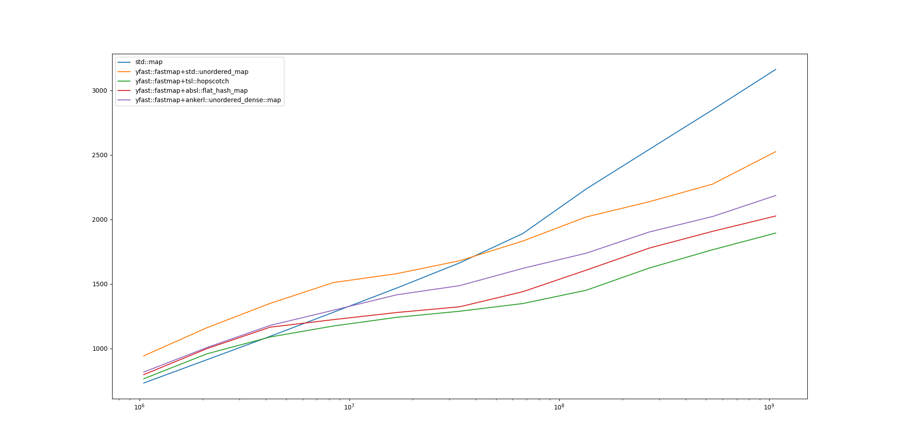
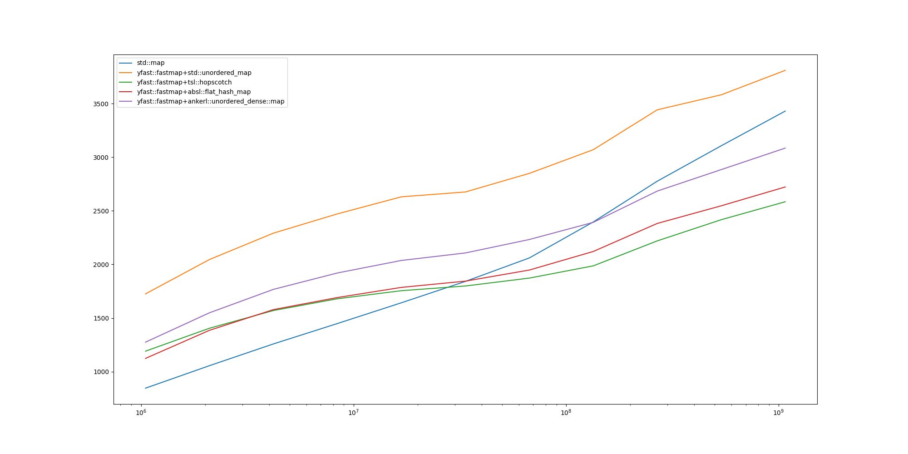
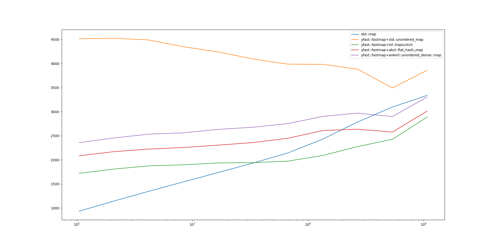

# yfast

**yfast** is a header-only C++20 template library that provides `yfast::fastmap` &mdash; a sorted associative container
based upon [Y-fast trie](https://en.wikipedia.org/wiki/Y-fast_trie)

Asymptotically all the basic operations (find exact match, find predecessor/successor, insert/delete) in the y-fast trie
data structure take amortized `O(ln H)` time (assuming `H` is the bit length of key). The main goal of this library is
to provide a faster container than classic sorted associative containers (represented in benchmark tests by `std::map`)
in practice. This, however, may only be achieved under certain conditions. Namely, to profit from using
`yfast::fastmap`, one:
- **must** operate a large size container (over one million entries for faster lookups and over ten million entries for
faster inserts)
- **must** _either_ index the container with an integral type _or_ provide an effective bit extraction mechanism
- **should** run on _ARM64_ architecture (especially if faster inserts are desired)
- **should** use custom hash table implementation

See [Performance](#performance) for details and benchmark test results

## Usage
### Template parameters
- `Key` &mdash; key type for the map to be indexed with; must be:
  - _copyable_ and
  - _bit-representable_ (see `BitExtractor`) and
  - _comparable_ (see `Compare`)
- `Value` &mdash; value type to be stored in the map; must be either
  - _copyable_ or
  - _movable_ or
  - `void` (in which case no value is stored in the map and iterator dereference policy alters)
- `H` &mdash; key length; doesn't have to be a power of two or match `sizeof(Key)`; cannot be less than `8` though
- `BitExtractor` &mdash; helper type to provide key shifts and bit extractions; must be compliant with
[yfast::internal::BitExtractorGeneric](include/yfast/internal/concepts.h) concept; whatever type is returned by
`shift()` must be hashable (see `Hash`); `yfast::fastmap` comes with a default implementation
`yfast::impl::BitExtractor` for these types:
  - all integral types
  - `std::vector<std::byte>`
  - `std::string` (which is basically treated as `std::vector<std::byte>`)
- `Hash` &mdash; map from shifted keys to `std::uintptr_t`; must be compliant with
[yfast::internal::MapGeneric](include/yfast/internal/concepts.h) concept and _default-constructible_;
[tsl::hopscotch_map](https://github.com/Tessil/hopscotch-map) is used as default (unless `YFAST_WITHOUT_HOPSCOTCH_MAP`
macro is defined, in which case `std::unordered_map` is used)
- `Compare` &mdash; key comparator; must be _copyable_; the order provided by `Compare` must match the lexicographic
order provided by `BitExtractor`; `std::less` is used as default
- `ArbitraryAllocator` &mdash; allocator; this allocator will not be used directly but rather rebound via
[std::allocator_traits::rebind_alloc](https://en.cppreference.com/w/cpp/memory/allocator_traits.html) (hence the
parameter name). `std::allocator<Key>` is used as default

### Basic usage example

    #include <cassert>
    #include <cstdint>
    #include <iostream>
    #include <iterator>
    #include <string>
    
    #include <unistd.h>
    
    #include <yfast/fastmap.h>
    #include <yfast/iterator.h>
    
    int main() {
        yfast::fastmap<std::uint32_t, std::string, 32> fastmap { {1, "one"}, {2, "two"}, {3, "three"} };
    
        std::cout << "values: ";
        for (const auto& v: fastmap) {
            std::cout << v << ' ';
        }
        std::cout << std::endl;
    
        assert(fastmap.size() == std::distance(fastmap.begin(), fastmap.end()));
    
        auto i = fastmap.find(2);
        auto r = yfast::make_reverse_iterator(i);
    
        std::cout << "erasing onward" << std::endl;
        while (i != fastmap.end()) {
            std::cout << i.key() << ' ' << i.value() << std::endl;
            i = fastmap.erase(i);
        }
    
        std::cout << "erasing backward" << std::endl;
        while (r != fastmap.rend()) {
            std::cout << r.key() << ' ' << r.value() << std::endl;
            r = fastmap.erase(r);
        }
    
        assert(fastmap.empty());
    
        return EXIT_SUCCESS;
    }

### Iterators
`yfast::fastmap` is equipped with mutable and const bidirectional iterators, both forward and reverse. Apart from
`rbegin`/`rend`/`crbegin`/`crend`, `yfast::fastmap` methods return forward iterators (const for const methods and
mutable otherwise). A reverse iterator may be obtained from a forward iterator by calling `make_reverse()` method or
`yfast::make_reverse_iterator()` template function.

#### iterator::value_type
Please note that `iterator::value_type` is `Value`, not `std::pair<Key, Value>`. Entry value is available via `*i` and
`i->`, as well as `i.value()`; (immutable) entry key is available via `i.key()`

`Value = void` is considered a special case, effectively turning `yfast::fastmap` into a "fastset". In this case
`iterator::value_type` becomes `const Key`

#### Iterator increment/decrement safety
- incrementing/decrementing an iterator which is neither `begin()` nor `end()`: always safe
- incrementing `begin()`: safe
- decrementing `begin()`: **undefined behaviour**
- incrementing `end()`: safe, no-op
- decrementing `end()`: safe (unless empty), points to the rightmost entry (with respect to the iterator direction)

#### Iterator reversion
- reverting an iterator `i` which is neither `begin()` nor `end()` gives a reverse iterator pointing to the same entry
as `--i`
- reverting `begin()` gives `rend()`
- reverting `end()` gives `rbegin()`

#### Iterator invalidation
Iterator **only** gets invalidated if:
- pointed entry is replaced via calling `insert()` with the equal key
- pointed entry is erased via `erase()`
- _in particular,_ all entries are erased by `clear()`
- _in particular,_ the container is destroyed
- the container is moved (in which case iterator still may be dereferenced but not incremented/decremented)

Iterator **does not** get invalidated and may be safely dereferenced and incremented/decremented if:
- other iterators pointing at the same entry are created
- the value of the pointed entry is modified
- new entries are inserted
- other entries are erased

## Performance
Every y-fast trie lookup operation (find match/predecessor/successor) performs `O(ln H)` key shifts and `O(ln H)` hash
lookups. Besides, insert/delete operations may perform up to `H` key bit extractions and up to `H` hash
insertions/deletions respectively. This said, to outperform `std::map`, these factors shall be taken into account:

### large size
According to tests (see below), the break-even point occurs **between one million and one hundred million** entries
depending on the operation. As a rule of thumb, if your map operates less than one million records, you are unlikely to
profit from using `yfast::fastmap`

### CPU architecture
Tests have been run on _x86-64_ and _ARM64_ CPUs. Whilst lookups are faster in `yfast::fastmap` on both architectures
for large enough containers (with break-even point below ten million entries), inserts are only faster on _ARM64_ (with
break-event point over ten million entries) but never on _x86-64_ (presumably due to different cache miss handling). On
the contrary, deletions do not differ significantly.

### effective bit operations
Only integral key types with single-cycle shifts and bit extractions proved to be effective enough. In other words,
indexing a map with, say, `std::uint64_t` would make it faster than `std::map` but indexing with `std::string` probably
would not. However, everything is possible if a fine-tuned `BitExtractor` is provided.

### custom hash map
These hash maps have been tested as underlying hash table:
- [std::unordered_map](https://en.cppreference.com/w/cpp/container/unordered_map.html)
- [tsl::hopscotch_map](https://github.com/Tessil/hopscotch-map)
- [absl::flat_hash_map](https://github.com/abseil/abseil-cpp) **NB:** Apache-2.0 license
- [ankerl::unordered_dense::map](https://github.com/martinus/unordered_dense)

Benchmark tests have been conducted in the following manner:

for a sample size `M`:
- populate container with `M` random keys
- generate random sample of another `M` keys
- **insert** sample keys one by one in a loop (thus doubling the size)
- measure clock time of the previous action
- **find** sample keys one by one in a loop
- measure clock time of the previous action
- **find and delete** sample keys one by one in a loop (thus halving the size)
- measure clock time of the previous action
- divide the clock times by sample size

Test source file may be found in [test/benchmark.cpp](test/benchmark.cpp)

Tests have been run on AWS _r6a.8xlarge_ and _m6g.16xlarge_ instances. Sample size on the x-axis, time in nanoseconds on
the y-axis

#### ARM64, find
<picture>
<source media="(prefers-color-scheme: dark)" srcset="plots/benchmark-uint32-arm64-find-dark.png">

</picture>

#### ARM64, insert
<picture>
<source media="(prefers-color-scheme: dark)" srcset="plots/benchmark-uint32-arm64-insert-dark.png">

</picture>

#### ARM64, find+erase
<picture>
<source media="(prefers-color-scheme: dark)" srcset="plots/benchmark-uint32-arm64-erase-dark.png">

</picture>

#### x86-64, find
<picture>
<source media="(prefers-color-scheme: dark)" srcset="plots/benchmark-uint32-x64-find-dark.png">

</picture>

#### x86-64, insert
<picture>
<source media="(prefers-color-scheme: dark)" srcset="plots/benchmark-uint32-x64-insert-dark.png">

</picture>

#### x86-64, find+erase
<picture>
<source media="(prefers-color-scheme: dark)" srcset="plots/benchmark-uint32-x64-erase-dark.png">

</picture>

Based on benchmark tests, [tsl::hopscotch_map](https://github.com/Tessil/hopscotch-map) has been picked as default

## Memory consumption
While maintaining linear memory use, `yfast::fastmap` consumes around 30% more RAM than `std::map` due to use of `H`
hash tables.
